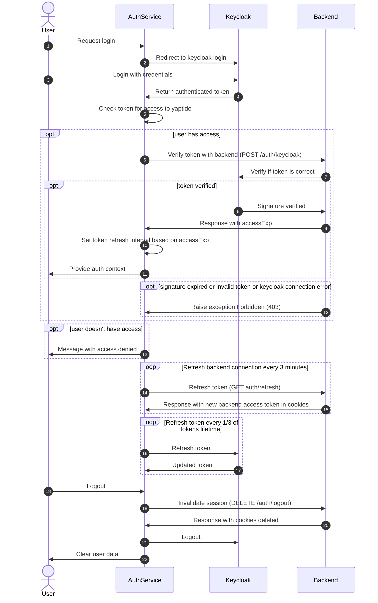
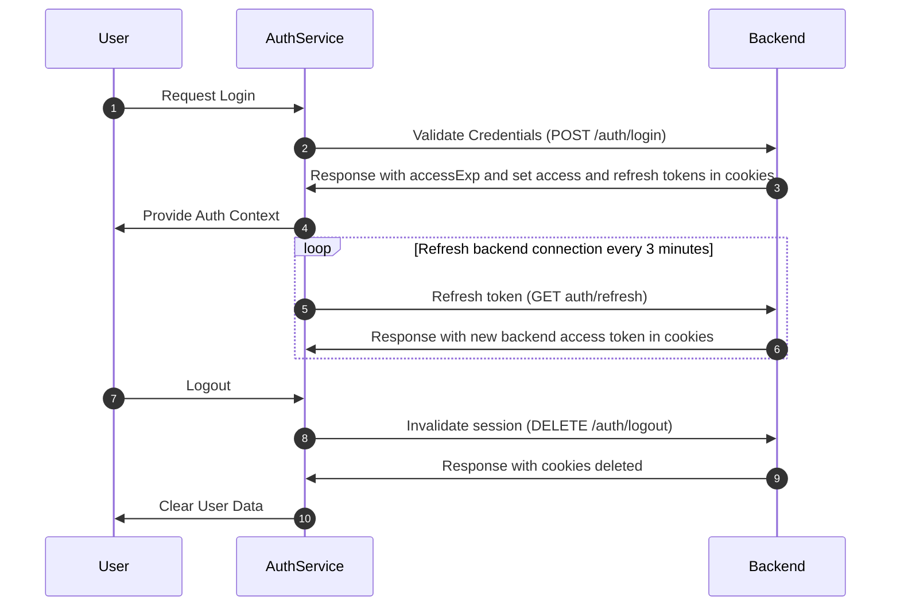

# Sequence diagrams

## Keycloak

Overview of login and logout process using keycloak

```mermaid
sequenceDiagram
    autonumber
    actor User
    participant AuthService
    participant Keycloak
    participant Backend

    User ->> AuthService: Request login
    AuthService ->> Keycloak: Redirect to keycloak login
    User ->> Keycloak: Login with credentials
    Keycloak ->> AuthService: Return authenticated token
    AuthService ->> AuthService: Check token for access to yaptide
    opt user has access
        AuthService ->> Backend: Verify token with backend (POST /auth/keycloak)
        Backend ->> Keycloak: Verify if token is correct
        opt token verified
            Keycloak ->> Backend: Signature verified
            Backend ->> AuthService: Response with accessExp
            AuthService ->> AuthService: Set token refresh interval based on accessExp
            AuthService ->> User: Provide auth context
        end
        opt signature expired or invalid token or keycloak connection error
            Backend ->> AuthService: Raise exception Forbidden (403)
        end
    end
    opt user doesn't have access
        AuthService ->> User: Message with access denied
    end
    loop Refresh backend connection every 3 minutes
        AuthService ->> Backend: Refresh token (GET auth/refresh)
        Backend ->> AuthService: Response with new backend access token in cookies
    end
    loop Refresh token every 1/3 of tokens lifetime
        AuthService ->> Keycloak: Refresh token
        Keycloak ->> AuthService: Updated token
    end
    User ->> AuthService: Logout
    AuthService ->> Backend: Invalidate session (DELETE /auth/logout)
    Backend ->> AuthService: Response with cookies deleted
    AuthService ->> Keycloak: Logout
    AuthService ->> User: Clear user data
```

## Non-Keycloak

Overview of login and logout process while in demo or dev modes

```mermaid
sequenceDiagram
    autonumber
    participant User
    participant AuthService
    participant Backend

    User ->> AuthService: Request Login
    AuthService ->> Backend: Validate Credentials (POST /auth/login)
    Backend ->> AuthService: Response with accessExp and set access and refresh tokens in cookies
    AuthService ->> User: Provide Auth Context
    loop Refresh backend connection every 3 minutes
        AuthService ->> Backend: Refresh token (GET auth/refresh)
        Backend ->> AuthService: Response with new backend access token in cookies
    end
    User ->> AuthService: Logout
    AuthService ->> Backend: Invalidate session (DELETE /auth/logout)
    Backend ->> AuthService: Response with cookies deleted
    AuthService ->> User: Clear User Data
```
