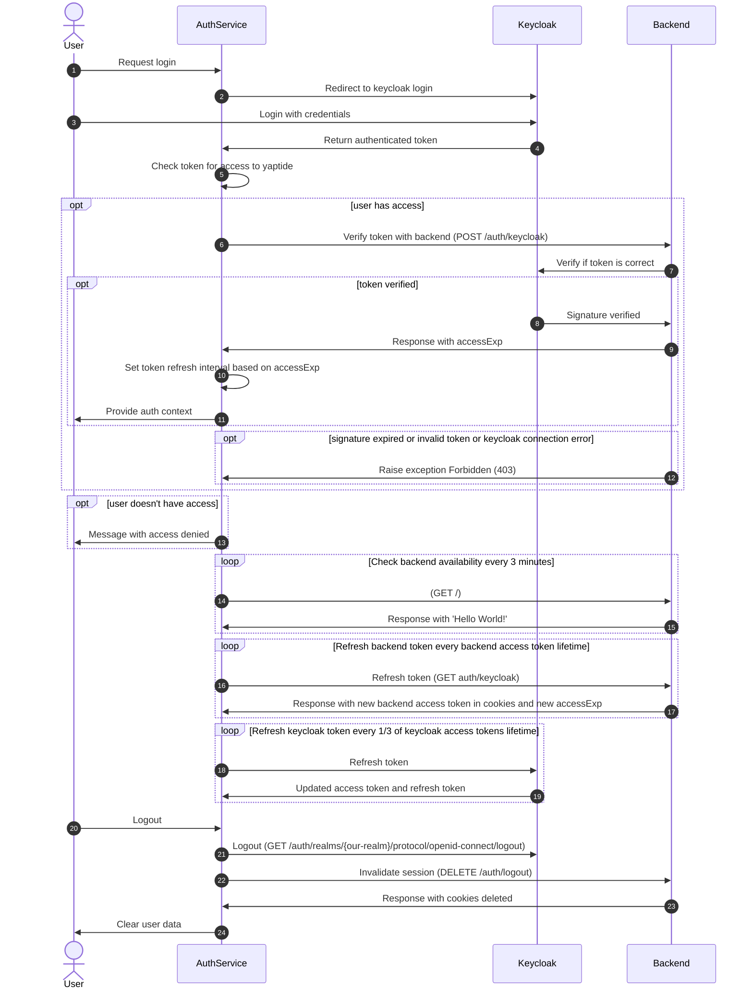
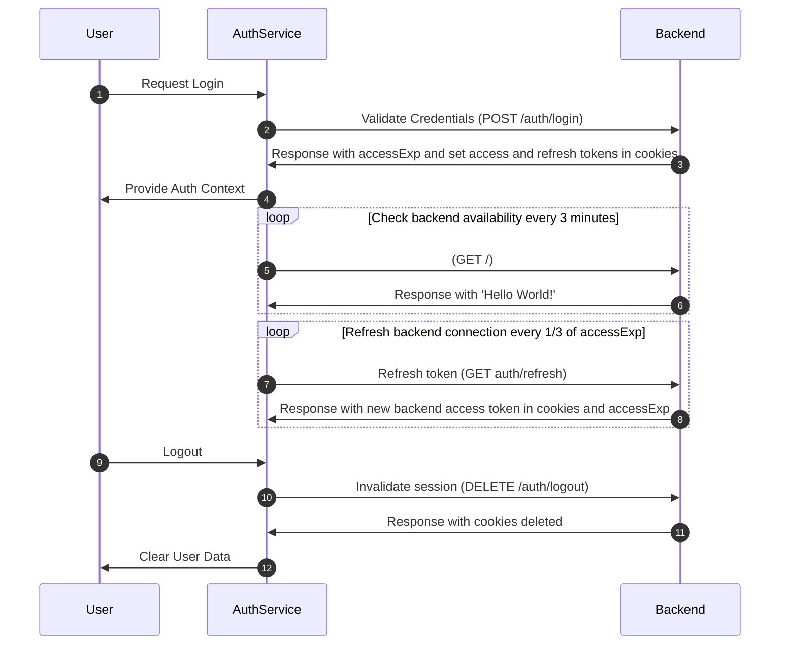

# Sequence diagrams

## Keycloak

Overview of login and logout process using keycloak

---

### **User Login Flow**

1️. **User requests login**

-   The user initiates login using SSO.

2️. **Redirect to Keycloak**

-   AuthService redirects the user to Keycloak login.

3️. **User login with credentials**

-   User enters credentials on the Keycloak page.

4️. **Authenticated token returned**

-   Keycloak returns an authenticated token to AuthService.

5️. **Token access check**

-   AuthService checks if the token grants access to Yaptide (checks `PLG_YAPTIDE_ACCESS` value).

---

### **Access Verification**

#### ✅ **If user has access**

-   6️. AuthService verifies the token with Backend.
-   7️. Backend checks the token with Keycloak.

-   **If verified**:

    -   8️. Keycloak confirms the token's signature.
    -   9️. Backend responds to AuthService with access expiration (`accessExp`).
    -   1️0. AuthService sets a token refresh interval based on `accessExp`.
    -   1️1. AuthService provides the user with authentication context.

-   **If verification fails**:
    -   1️2. Backend sends a **403 Forbidden** error if the token is invalid, expired, or there's a Keycloak error.

#### ❌ **If user lacks access**

-   1️3. AuthService notifies the user of access denial.

---

### **Periodic Health Checks**

#### 🔄 **Backend Connection Check**

-   1️4. Every 3 minutes, AuthService checks Backend availability.
-   1️5. Backend responds with a "Hello World!" message.

#### 🔄 **Backend Token Refresh**

-   1️6. At each `accessExp` expiration, AuthService requests a token refresh.
-   1️7. Backend responds with a new access token and updated `accessExp` in cookies.

#### 🔄 **Keycloak Token Refresh**

-   1️8. Every 1/3 of the Keycloak token’s lifetime, AuthService refreshes the Keycloak token.
-   1️9. Keycloak provides an updated access and refresh token.

---

### **Logout Process**

2️0. **User initiates logout**

-   The user requests logout.

2️1. **Logout from Keycloak**

-   AuthService logs the user out of Keycloak.

2️2. **Invalidate session with Backend**

-   AuthService invalidates the user session with Backend.

2️3. **Session cookies deleted**

-   Backend deletes the session cookies and confirms.

2️4. **Clear local data**

-   AuthService clears the user’s data from the local session.

---

## Our own database of users validation

Overview of login and logout process while in dev deployment using docker

---

### **User Login Process**

1️. **User login request**

-   User initiates a login request through AuthService.

---

### **Credential Validation**

2️. **Send credentials for validation**

-   AuthService sends login credentials to Backend for verification.

3️. **Receive `accessExp` and tokens**

-   Backend responds with `accessExp`, setting access and refresh tokens in cookies.

---

### **Provide Authentication Context**

4️. **Provide auth context to user**

-   AuthService provides the authenticated context to the user.

---

### **Backend Availability Check**

5️. **Periodic availability check**

-   Every 3 minutes, AuthService checks Backend availability.

6️. **Backend response**

-   Backend responds with a "Hello World!" message to confirm availability.

---

### **Backend Token Refresh**

7️. **Periodic token refresh**

-   Every 1/3 of `accessExp` (1/3 of Backend access token lifetime), AuthService refreshes the token with Backend.

8️. **Receive new token and `accessExp`**

-   Backend returns a new access token in cookies and an updated `accessExp`.

---

### **Logout Process**

9️. **User initiates logout**

-   The user requests to log out.

1️0. **Invalidate session with Backend**

-   AuthService sends a session invalidation request to Backend.

1️1. **Session cookies deleted**

-   Backend deletes session cookies and confirms the logout.

1️2. **Clear user data**

-   AuthService clears the user's data from the local session.

---

## **Default Token Values**

**Keycloak token values** (defined by Keycloak server on Ares):

-   🔹 **Keycloak access token**: 5 minutes
-   🔹 **Keycloak refresh token**: 30 minutes

**Backend token values** (defined in Backend repository):

-   🔹 **Backend access token**: 10 minutes
-   🔹 **Backend refresh token**: 120 minutes

---
