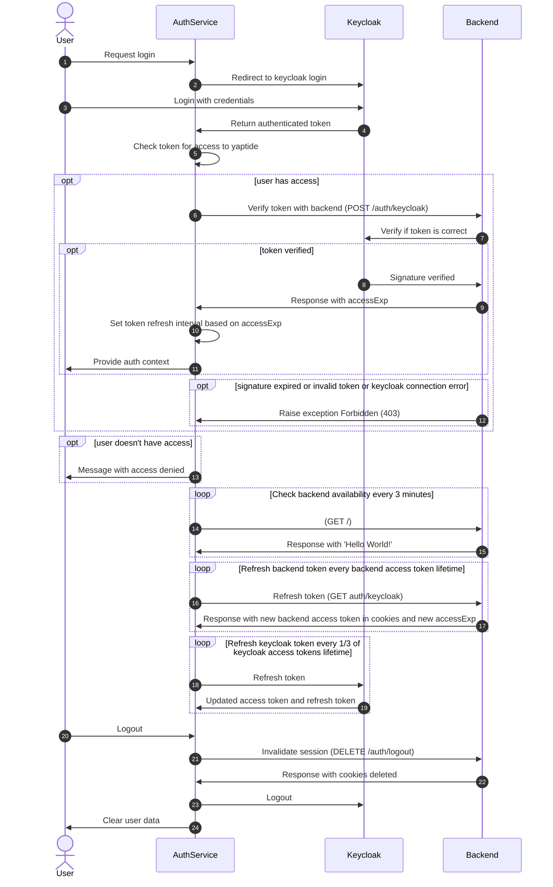
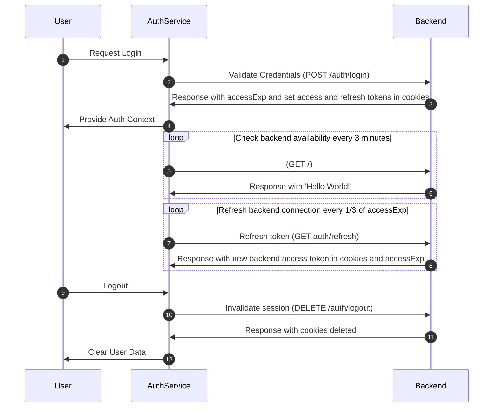

# Sequence diagrams

## Keycloak

Overview of login and logout process using keycloak

-   **User requests login**: User initiates login with SSO.
-   **Redirect to Keycloak**: AuthService redirects user to Keycloak login.
-   **User login with credentials**: User provides credentials on Keycloak.
-   **Authenticated token returned**: Keycloak provides AuthService with an authenticated token.
-   **Token access check**: AuthService checks token for access to Yaptide (token includes PLG_YAPTIDE_ACCESS value)

-   **User access verification**:

    -   **If user has access**:
        AuthService verifies token with Backend.
        Backend confirms token with Keycloak.
        -   **If verified**:
            Keycloak validates the token signature.
            Backend provides access expiration (`accessExp`) to AuthService.
            AuthService sets token refresh interval based on `accessExp` (backend token valid time).
            User receives authentication context.
        -   **If verification fails**: Backend sends "Forbidden" error due to invalid/expired token or Keycloak error.
    -   **If user lacks access**: AuthService informs user of access denial.

-   **Backend connection check**: Every 3 minutes, AuthService checks backend availability.
-   **Backend token periodic refresh**:

    -   Every backend token lifetime (`accessExp`), AuthService requests a token refresh from Backend.
    -   Backend responds with a new access token in cookies and an updated `accessExp`.

-   **Keycloak token periodic refresh**:

    -   Every 1/3 of the keycloak access token's lifetime, AuthService refreshes the Keycloak token.
    -   Keycloak provides an updated access token and refresh token to AuthService.

-   **Logout process**:
    -   User initiates logout.
    -   AuthService invalidates Backend session.
    -   Backend deletes session cookies.
    -   AuthService logs user out of Keycloak and clears user data.

## Non-Keycloak

Overview of login and logout process while in demo or dev modes

-   **User login request**: User requests login through AuthService.

-   **Credential validation**:

    -   AuthService sends login credentials to Backend for validation.
    -   Backend responds with `accessExp`, setting access and refresh tokens in cookies.

-   **Provide authentication context**: AuthService provides the authenticated context to the user.

-   **Backend availability check**:

    -   Every 3 minutes, AuthService checks Backend availability.
    -   Backend responds with a "Hello World!" message.

-   **Backend token refresh**:

    -   Every 1/3 of `accessExp` (1/3 of Backend access token), AuthService refreshes the token with Backend.
    -   Backend returns a new access token in cookies and an updated `accessExp`.

-   **Logout process**:
    -   User initiates logout.
    -   AuthService sends a session invalidation request to Backend.
    -   Backend deletes session cookies, confirming logout.
    -   AuthService clears the user's data.

## Default vaules

-   Keycloak access token - 5 min valid time
-   Keycloak refresh token - 30 min valid time

-   Backend access token - 10 min valid time
-   Backend refresh token - 120 min valid time
